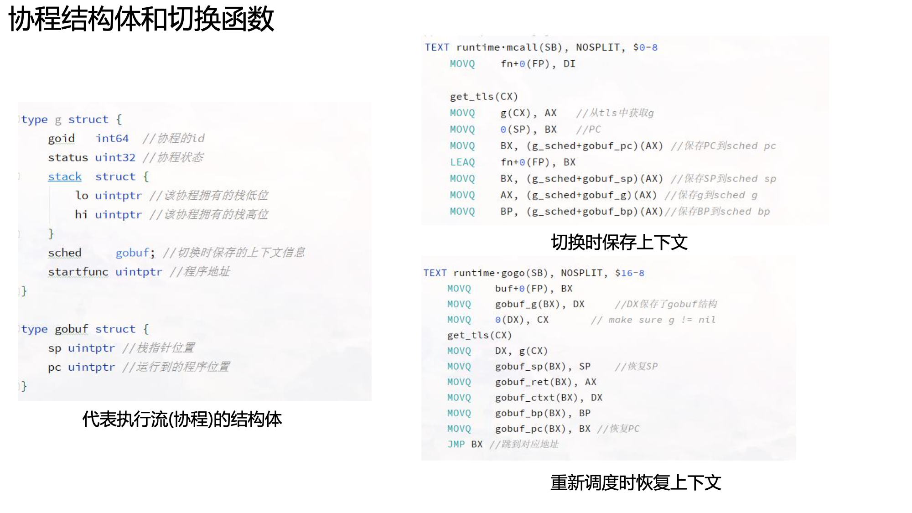

Go GMP调度模型
============

## 前言

这里先介绍一下进程，线程：

* 进程：进程是操作系统分配资源的最小单位，拥有独立的地址空间和系统资源
* 线程：线程是进程的一个实体，是CPU调度和分派的基本单位。一个进程拥有多个线程，各线程拥有属于自己的程序计数器(PC)，一组寄存器，以及堆栈，并共享进程系统资源。虽然线程以及进程调度都会进行系统调用，进行用户态以及内核态切换，但是由于线程资源占用少，因此切换成本小很多

这里给出两者的优劣对比：

* 进程之间的通信需要以通信的方式（Inter Process Communication，IPC)进行；而线程之间的通信更方便，因为同一进程下的线程共享资源(如何处理好线程同步与互斥是编写多线程程序的难点)
* 线程的调度与切换比进程快很多，同时创建一个线程的开销也比进程要小很多
* 多进程程序更健壮，多线程程序只要有一个线程死掉，整个进程也死掉了；而一个进程死掉并不会对另外一个进程造成影响，因为进程之间相互独立

而为了进一步增加共享以及减少切换成本，衍生出了协程。协程实际上是用户态的线程，代表了一个执行流，拥有需要执行的函数地址，程序计数器(PC)以及栈帧(SP)等

